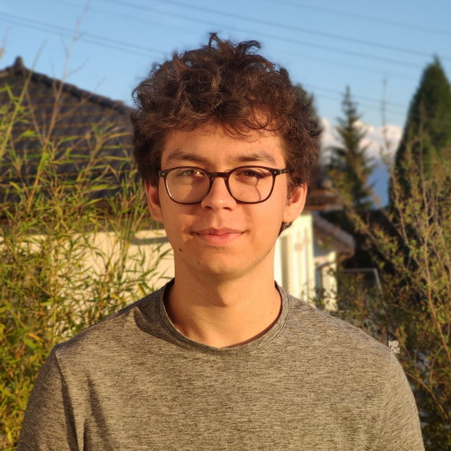

## My journey

I was born in Switzerland in 2002 and I have lived in this country since then. I have always been a very curious person in quest to learn something new everyday. I did a lot of different sports as a kid like tennis, swimming, floorball and basketball. I didn't really like going to school because we needed to learn lots of things that I found useless and we didn't put into practice what we learned. Therefore, I had done lots of extracurricular activities like sports.

My family and I moved to another house in 2012 (I had 10 years old) and I was not able to carry on training into the same sport clubs I was before. I started lokking at other interesting activities to satisfy my appetite for learning. This is when I started programming. I stared to code on <a href="https://www.arduino.cc" target="_blank">Arduino</a> boards because I wanted to do something that was actually doing something visible like turning on and off an led on a button press and stuff like that. I then really quickly started to learn <a href="https://www.python.org" target="_blank">Python</a> because it is a relatively simple programming language and it is really popular (so there are a lots of tutorials and answers to specific questions). At this point, I fell in love with Computer Science and I realized how huge this new 'world' was and all the things we can accomplished with it.

XXXXXXXXXXXXXXXXX EPFL

## Coding

As I said in the [My journey](#my-journey) I started to code at the age of 10 with <a href="https://www.arduino.cc" target="_blank">Arduino</a> boards which is a bit like C. After that, I received a <a href="https://fr.wikipedia.org/wiki/Lego_Mindstorms" target="_blank">LEGO Mindstorms</a> as an anniversary gift. I was really happy because I always loved playing LEGOs and it was really simple to program (interface with blocks) XXXXXXXXXXXXXXXXXXX contest

I then learned how to code in <a href="https://www.python.org" target="_blank">Python</a> and I wanted to explore all the different things we can do with Computer Science. Therefore, I started to learn <a href="https://fr.wikipedia.org/wiki/Hypertext_Markup_Language" target="_blank">HTML</a> and <a href="https://en.wikipedia.org/wiki/Cascading_Style_Sheets" target="_blank">CSS</a> in order to build my first websites and I really liked the simplicity of creating a basic interface with some forms and to style everything etc. I just wasn't totally satisfied because it was all static and this lead me to <a href="https://fr.wikipedia.org/wiki/JavaScript" target="_blank">JavaScript</a>. I learned how to interact with the content of my website and stile everything dynamically but I still wanted to go further and this is when I discovered the differences between the front-end and the back-end. I immediately learned the first programming language that I found about back-end web development which was <a href="www.php.net" target="_blank">PHP</a>. At this time, everything was perfect I just needed to learn <a href="https://fr.wikipedia.org/wiki/Structured_Query_Language" target="_blank">SQL</a> in order to have a full database working on my server with my PHP and everything was perfect. I learned a lot of different things throughout all of this and I did a lot of small projects at each step and new element I was learning in order to see my progression and further understand what I was doing.

During all of this I was still learning Python, which is by far the language that I know the most, and as I was learning more and more advanced Python concepts, I clicked: I could mixed up everything. Until this time, I always separated Arduino, Web development and Python but I could make a project that would link everything together. We were in 2017 and this is when I started to look at IOT. XXXXXXXXX raspberrypi

## Strengths and weaknesses

## Contact me
