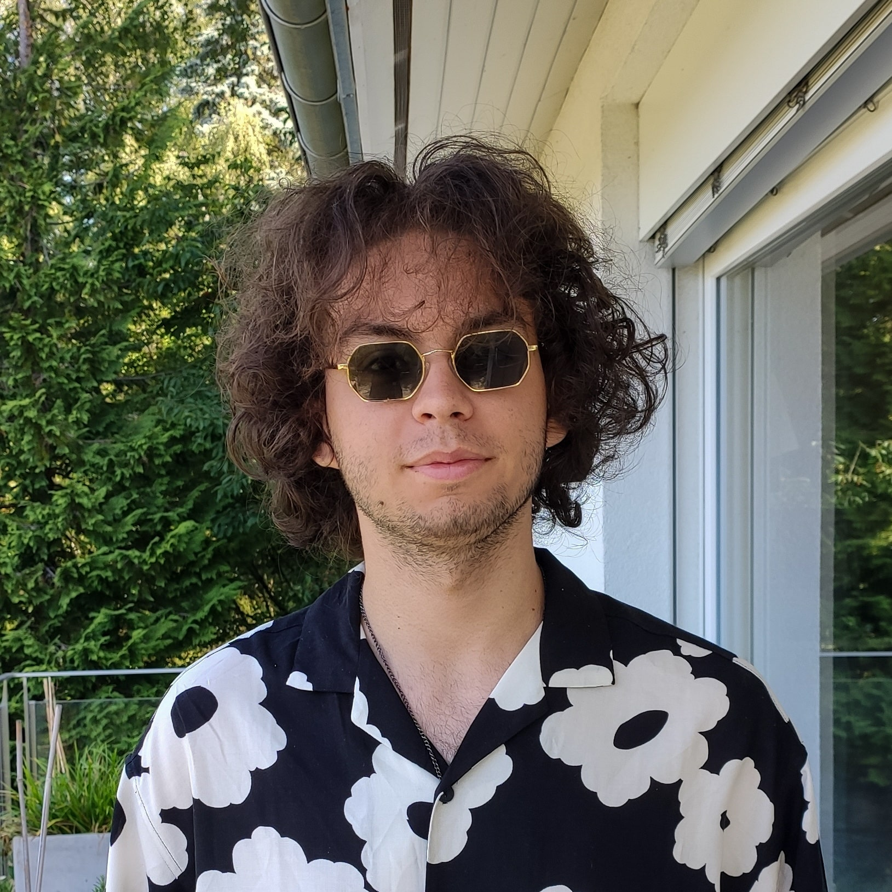
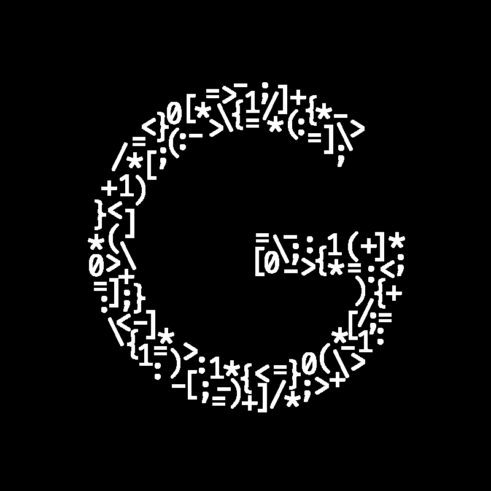

## My journey

I was born in Switzerland in 2002 and I have lived there since then.
I have always been a very curious person in quest to learn something new everyday.
I did a lot of different sports as a kid like tennis, swimming, floorball, basketball and young firefighters.
I didn't really like going to school because we needed to learn lots of things that I found useless and we didn't put into practice what we learned.
Therefore, I have done lots of extracurricular activities like sports.

My family and I moved to another house in 2012 (I was 10 years old) and I was not able to continue training in the same sport clubs as before.
I started looking at other interesting activities to satisfy my appetite for learning. This is when I started programming.
I stared to code on <a href="https://www.arduino.cc" target="_blank">Arduino</a> boards because I wanted to do something that interacted with the physical world such as turning on and off an led on a button press and so on.
I then really quickly started to learn <a href="https://www.python.org" target="_blank">Python</a> because it is a relatively simple programming language and it is really popular (so there are a lots of tutorials and answers to specific questions).
At this point, I fell in love with computer science and I realized how huge this new world was and all the things we can accomplish with it.

After finishing high school, I decided to pursue learning computer science and I went to a preparation year at the <a href="https://www.epfl.ch/" target="_blank">EPFL</a> in math.
I am currently in my first year of computer science there.

## Coding

As I said in [My journey](#my-journey) I started to code at the age of 10 with <a href="https://www.arduino.cc" target="_blank">Arduino</a> boards which is a bit like <a href="https://en.wikipedia.org/wiki/C_(programming_language)" target="_blank">C</a>.
After that, I received a <a href="https://en.wikipedia.org/wiki/Lego_Mindstorms" target="_blank">LEGO Mindstorms</a> as a birthday gift.
I was really happy because I always loved playing LEGOs and it was pretty simple to program (interface with blocks).
Then, I decided to participate in a robotic contest at the LemanMake event.
I created and programmed my robot for about one year and I finished second place.

I then learned how to code in <a href="https://www.python.org" target="_blank">Python</a> and I wanted to explore all the different things that Computer Science has to offer.
Therefore, I started to learn <a href="https://en.wikipedia.org/wiki/Hypertext_Markup_Language" target="_blank">HTML</a> and <a href="https://en.wikipedia.org/wiki/Cascading_Style_Sheets" target="_blank">CSS</a> in order to build my first websites and I really liked the simplicity of creating a basic interface with some forms and to style everything.
I just wasn't totally satisfied because it was all static and this led me to <a href="https://en.wikipedia.org/wiki/JavaScript" target="_blank">JavaScript</a>.
I learned how to interact with the content of my websites and style everything dynamically but I still wanted to go further and this is when I discovered the differences between the front-end and the back-end.
I immediately learned the first programming language that I found about back-end web development which was <a href="https://www.php.net" target="_blank">PHP</a>.
At that time, I learned <a href="https://en.wikipedia.org/wiki/Structured_Query_Language" target="_blank">SQL</a> in order to have a full database working on my server with my PHP and everything was perfect.
I learned a lot of different things throughout all of this and I did a lot of small projects at each step of the way in order to see my progression and further understand what I was doing.

During all of this I was still learning Python, which is by far the language that I know the most, and as I was learning more and more advanced Python concepts, I realized something: I could mix everything up.
Until that time, I had always separated Arduino, Web development and Python but I could make a project that would link everything together.
We were in 2017 and this is when I started to look at IOT.
I often use a <a href="https://www.raspberrypi.org/" target="_blank">Raspberry Pi</a> along with Arduino boards in my different projects, especially in IOT.
I later learned and mastered Python <a href="https://pypi.org/project/Flask/" target="_blank">Flask</a> framework for building RESTful APIs.

I am still coding a lot and doing small projects in my free time in order to continue improving myself as a developer.
I am currently learning <a href="https://flutter.dev/" target="_blank">Flutter</a> in order to build IOS and Android applications.

## Strengths and weaknesses

As I said many times, I am very curious.
I always want to know how something works and I am never missing an opportunity to learn.
I am also very independent, I have no problem with facing issues that are coming up and finding answers by myself.
I learned a lot alone with the ressources that I found which gave me a lot of experience.
I tend to be too perfectionist which can sometimes slow down my productivity as it is hard for me not to make everything neat and clean before moving on to something else.
I am also a bit impatient and want to start quickly before having a real full understanding of what I am actually doing.
Appart from that, I am well organized and I like to keep track of what I am doing and what needs to be done.

## Contact me

Developer professional e-mail: <a href="mailto:gruvw.dev@gmail.com" target="_blank">gruvw.dev@gmail.com</a>
